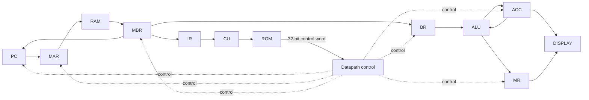

# Microprogrammed CPU on FPGA

一个在计算机组成原理课程中完成的 16 位微程序 CPU，使用 Verilog 实现，目标板为 Nexys A7-100T（Artix-7 XC7A100T），原工程使用 Vivado 2023.2。

课程项目由李源晟、张扬共同完成。仓库是在原实验工程基础上做的公开整理：保留 RTL、RAM/ROM 初始化内容、板级约束和仿真入口，去掉 Vivado 自动生成的缓存、日志和实现目录，并补充可重新建立工程的 Tcl 脚本。

## 设计概况

- 16 位数据通路
- 16 位定长指令：高 8 位为 opcode，低 8 位为地址字段
- 8 位地址空间，主存为 256 × 16 bit
- 控制存储器为 256 × 32 bit
- 微程序控制器将一条机器指令展开成多个微操作执行
- ACC 保存主要运算结果，MR 保存有符号乘法结果的高 16 位
- 支持 LOAD / STORE、算术逻辑、移位和条件/无条件跳转
- ACC 与 MR 可显示在 Nexys A7 的八位七段数码管上



32 位控制字、公共 FETCH 流程和各条指令的微程序入口整理在 [`docs/design-notes.md`](docs/design-notes.md)。

## 指令集

| Opcode | 指令 | 功能 |
|---:|---|---|
| `01` | `STORE X` | `ACC → M[X]` |
| `02` | `LOAD X` | `M[X] → ACC` |
| `03` | `ADD X` | `ACC + M[X] → ACC` |
| `04` | `SUB X` | `ACC - M[X] → ACC` |
| `05` | `JMPGEZ X` | ACC 非负时跳转到 X |
| `06` | `JMP X` | 无条件跳转到 X |
| `07` | `HALT` | 停止微操作 |
| `08` | `MUL X` | signed `ACC × M[X] → {MR, ACC}` |
| `0A` | `AND X` | 按位与 |
| `0B` | `OR X` | 按位或 |
| `0C` | `NOT` | 对当前 ACC 按位取反 |
| `0D` | `SHR` | 逻辑右移 |
| `0E` | `SHL` | 逻辑左移 |
| `0F` | `SAR` | 算术右移 |
| `10` | `SAL` | 算术左移 |
| `11` | `XOR X` | 按位异或 |
| `12` | `NXOR X` | 按位同或 |

`NOT` 和四条移位指令在当前实现中只操作 ACC，指令低 8 位不参与运算。

## 目录

```text
.
├─ rtl/                  # CPU 与数码管 RTL
├─ sim/                  # 基础 testbench
├─ constraints/          # Nexys A7-100T 引脚与 100 MHz 时钟约束
├─ ip/
│  ├─ blk_ram/ram.coe    # 主存初始化
│  └─ blk_rom/rom.coe    # 微程序控制字
├─ docs/design-notes.md  # 控制字与微程序说明
├─ create_project.tcl    # 重新建立 Vivado 工程和 Block Memory IP
└─ .gitignore
```

## 在 Vivado 中重新建立工程

仓库不提交完整的 `.xpr`、`.runs`、`.cache` 或生成后的 IP 文件。克隆后，在 Vivado 2023.2 的 Tcl Console 中执行：

```tcl
cd <repo-path>
source create_project.tcl
```

脚本会：

1. 创建面向 `xc7a100tcsg324-1` 的工程；
2. 加入 `rtl/` 下的 Verilog 文件；
3. 按原工程参数重新创建 256×16 Single Port RAM 和 256×32 Single Port ROM；
4. 加载两份 `.coe` 初始化文件；
5. 加入 Nexys A7-100T 约束和 testbench。

随后可以运行 Behavioral Simulation，或继续执行 Synthesis、Implementation 和 Generate Bitstream。

## 仿真与课程测试

`sim/cpu_sim.v` 提供基础 testbench。复位释放后，CPU 从地址 `0x00` 开始执行 `ram.coe` 中的程序，并检查控制器是否最终进入 `HALT` 的微地址 `0x62`。

课程实验中另外使用过几组小程序验证指令执行：

- 循环计算 `1 + 2 + ... + 10`，覆盖 LOAD / STORE / ADD / SUB / JMPGEZ / HALT，最终 `ACC = 0037H`；
- 使用 `7995H × CD50H` 检查 signed MUL，乘法后得到 `{MR, ACC} = E7ED4F90H`；
- 以 `8001H` 为初值比较 SAR、SHR、SHL 和 SAL；
- 使用 `JMP 03H` 验证无条件跳转不会执行中间指令。

调试微程序时建议同时观察：

```text
pc2mar  ram_addr  mbr  ir2cu  rom_addr  cs  acc  mr  flag
```

其中 `rom_addr` 是当前微地址，`cs` 是 ROM 给出的 32 位控制字。

## FPGA 约束

目标板使用 Nexys A7-100T：

- `E3`：100 MHz 板载时钟
- `C12`：CPU_RESETN，RTL 中按低有效复位使用
- 八位七段数码管：低四位显示 ACC，高四位显示 MR

原课程工程只包含引脚约束，没有显式 `create_clock`，因此旧 timing report 处于未约束状态。当前仓库在 `constraints/nexys_a7_100t.xdc` 中补上了 10 ns 时钟约束。

## 原工程实现记录

原 Vivado 2023.2 工程曾完成综合、布局布线和 bitstream 生成。该次实现大约使用：

- 223 LUT
- 199 个寄存器
- 2 个 RAMB18（1 个 BRAM Tile）
- 1 个 DSP48E1

因为原工程当时没有时钟约束，这里不使用旧 WNS/TNS 作为时序指标。当前整理版需要在本地 Vivado 中重新跑实现后，才能得到有意义的 timing 结果。

## 说明

这是一个课程性质的小型 CPU，不是完整 ISA 或通用处理器实现。仓库保留的是原设计的数据通路和微程序控制思路，重点是能直接对照取指、译码和执行过程阅读代码，而不是把课程项目扩成一个复杂框架。
