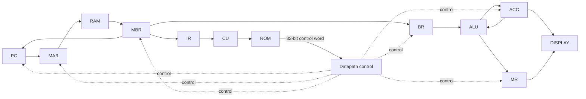

# Microprogrammed CPU on FPGA

一个在计算机组成原理课程中完成的 16 位微程序 CPU，使用 Verilog 实现，面向 Nexys A7-100T（Artix-7 XC7A100T），工程基于 Vivado 2023.2。

项目由李源晟、张扬共同完成。仓库在课程工程基础上做了整理：保留 RTL、RAM/ROM 初始化内容、板级约束和仿真入口，去掉 Vivado 自动生成的缓存、日志和实现目录，并用 Tcl 脚本重新建立工程和 Block Memory IP。

## 设计概况

- 16 位数据通路
- 16 位定长指令：高 8 位为 opcode，低 8 位为地址字段
- 8 位地址空间，主存为 256 × 16 bit
- 控制存储器为 256 × 32 bit
- 微程序控制器将一条机器指令展开成多个微操作执行
- ACC 保存主要运算结果，MR 保存有符号乘法结果的高 16 位
- 支持 LOAD / STORE、算术逻辑、移位和条件/无条件跳转
- ACC 与 MR 通过八位七段数码管显示



32 位控制字、公共 FETCH 流程和各条指令的微程序入口整理在 [`docs/design-notes.md`](docs/design-notes.md)。

## 指令集

| Opcode | 指令 | 功能 |
|---:|---|---|
| `01` | `STORE X` | `ACC → M[X]` |
| `02` | `LOAD X` | `M[X] → ACC` |
| `03` | `ADD X` | `ACC + M[X] → ACC` |
| `04` | `SUB X` | `ACC - M[X] → ACC` |
| `05` | `JMPGEZ X` | ACC 非负时跳转到 X |
| `06` | `JMP X` | 无条件跳转到 X |
| `07` | `HALT` | 停止微操作 |
| `08` | `MUL X` | signed `ACC × M[X] → {MR, ACC}` |
| `0A` | `AND X` | 按位与 |
| `0B` | `OR X` | 按位或 |
| `0C` | `NOT` | 对当前 ACC 按位取反 |
| `0D` | `SHR` | 逻辑右移 |
| `0E` | `SHL` | 逻辑左移 |
| `0F` | `SAR` | 算术右移 |
| `10` | `SAL` | 算术左移 |
| `11` | `XOR X` | 按位异或 |
| `12` | `NXOR X` | 按位同或 |

`NOT` 和四条移位指令只操作当前 ACC，指令低 8 位不参与运算。

## 课程分工

- **李源晟**：CPU 整体结构与控制单元，主要完成指令集设计、微程序入口地址规划、32 位控制信号分配、CU 控制逻辑与 ROM 控制字整理和调试。
- **张扬**：数据通路模块与系统测试，主要完成各寄存器/ALU 模块整理、顶层连线、RAM 初始化、仿真测试和数码管显示分析。

## 目录

```text
.
├─ rtl/                  # CPU 与数码管 RTL
├─ sim/                  # 基础 testbench
├─ constraints/          # Nexys A7-100T 板级约束
├─ ip/
│  ├─ blk_ram/ram.coe    # 主存初始化
│  └─ blk_rom/rom.coe    # 微程序控制字
├─ docs/design-notes.md  # 控制字与微程序说明
├─ create_project.tcl    # Vivado 工程与 Block Memory IP 重建脚本
└─ .gitignore
```

## Vivado 工程

克隆仓库后，在 Vivado 2023.2 的 Tcl Console 中执行：

```tcl
cd <repo-path>
source create_project.tcl
```

脚本会创建面向 `xc7a100tcsg324-1` 的工程，加入 `rtl/` 下的 Verilog 文件，创建 256×16 Single Port RAM 和 256×32 Single Port ROM，加载两份 `.coe` 初始化文件，并加入板级约束和 testbench。

工程建立后可运行 Behavioral Simulation，也可继续执行 Synthesis、Implementation 和 Generate Bitstream。

## 仿真与课程测试

`sim/cpu_sim.v` 提供基础 testbench：复位释放后从地址 `0x00` 开始执行 `ram.coe` 中的程序，并在 5000 个时钟周期后检查控制器是否进入 `HALT` 对应的微地址 `0x62`。

课程实验中使用过四组程序覆盖主要指令：

- 循环计算 `1 + 2 + ... + 10`，覆盖 LOAD / STORE / ADD / SUB / JMPGEZ / HALT，最终 `ACC = 0037H`；
- 使用 `7995H × CD50H` 检查 signed MUL，乘法后 `{MR, ACC} = E7ED4F90H`，随后继续验证 AND / OR / XOR / NXOR / NOT；
- 以 `8001H` 为初值依次测试 SAR / SHR / SHL / SAL；
- 使用 `JMP 03H` 验证无条件跳转，目标数据最终装入 ACC。

调试微程序时可以同时观察：

```text
pc2mar  ram_addr  mbr  ir2cu  rom_addr  cs  acc  mr  flag
```

其中 `rom_addr` 是当前微地址，`cs` 是 ROM 输出的 32 位控制字。

## FPGA 约束

`constraints/nexys_a7_100t.xdc` 包含 Nexys A7-100T 的板级连接：

- `E3`：100 MHz 板载时钟，并定义 10 ns 时钟周期
- `C12`：CPU_RESETN，RTL 中按低有效复位使用
- 八位七段数码管：低四位显示 ACC，高四位显示 MR

## 实现记录

课程工程在 Vivado 2023.2 中完成了综合、布局布线和 bitstream 生成。实现结果使用：

- 223 Slice LUTs
- 199 Slice Registers
- 2 个 RAMB18（1 个 Block RAM Tile）
- 1 个 DSP48E1

这是一个课程性质的小型 CPU，重点是把取指、译码、微程序控制、内存访问、ALU 运算和写回过程落实到寄存器级数据通路中，便于直接对照计算机组成原理阅读和调试。