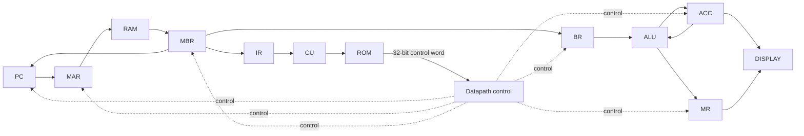

# Microprogrammed CPU on FPGA

一个在计算机组成原理课程中完成的 16 位微程序 CPU，使用 Verilog 实现，目标板为 Nexys A7-100T（Artix-7 XC7A100T），原工程使用 Vivado 2023.2。

这个项目主要用来把课上讲的数据通路、取指/译码、微程序控制、主存读写和条件转移真正连起来。仓库没有保留 Vivado 的缓存、日志和实现目录，只留下重新生成工程需要的 RTL、约束、IP 配置以及 RAM/ROM 初始化文件。

## 设计概况

- 16 位数据通路
- 8 位地址，主存为 256 × 16 bit
- 控制存储器为 256 × 32 bit
- 16 位指令：高 8 位为 opcode，低 8 位为地址或操作数字段
- 微程序控制器根据 IR 中的 opcode 跳转到对应微程序入口
- ACC 保存主要运算结果，MR 保存乘法结果的高 16 位
- ACC 和 MR 可显示在 Nexys A7 的 8 位七段数码管上



各寄存器和控制位的对应关系见 [`docs/design-notes.md`](docs/design-notes.md)。

## 指令

| Opcode | 指令 | 说明 |
|---:|---|---|
| `01` | `STORE X` | ACC 写入主存 X |
| `02` | `LOAD X` | 主存 X 读入 ACC |
| `03` | `ADD X` | ACC + M[X] |
| `04` | `SUB X` | ACC - M[X] |
| `05` | `JMPGEZ X` | ACC 非负时跳转 |
| `06` | `JMP X` | 无条件跳转 |
| `07` | `HALT` | 停机 |
| `08` | `MUL X` | 16 × 16 位乘法，低 16 位进入 ACC，高 16 位进入 MR |
| `0A` | `AND X` | 按位与 |
| `0B` | `OR X` | 按位或 |
| `0C` | `NOT` | 按位取反 |
| `0D` | `SHR` | 逻辑右移 |
| `0E` | `SHL` | 逻辑左移 |
| `0F` | `SAR` | 算术右移 |
| `10` | `SAL` | 算术左移 |
| `11` | `XOR X` | 异或 |
| `12` | `NXOR X` | 同或 |

## 目录

```text
.
├─ rtl/                  # CPU 与数码管 RTL
├─ sim/                  # 基础 testbench
├─ constraints/          # Nexys A7-100T 引脚与 100 MHz 时钟约束
├─ ip/
│  ├─ blk_ram/           # 256 × 16 主存及 ram.coe
│  └─ blk_rom/           # 256 × 32 控制存储器及 rom.coe
├─ docs/                 # 控制字、微程序入口和示例程序说明
├─ create_project.tcl    # 重新建立 Vivado 工程
└─ .gitignore
```

## 在 Vivado 中重新建立工程

仓库不提交完整的 `.xpr`、`.runs`、`.cache` 等生成内容。克隆后，在 Vivado 2023.2 的 Tcl Console 中执行：

```tcl
cd <repo-path>
source create_project.tcl
```

脚本会在 `build/` 下建立工程，加入 RTL、Block Memory Generator IP、约束和 testbench，并把 RAM/ROM 的初始化文件指向仓库中的 `.coe` 文件。

随后可以直接运行 Behavioral Simulation，也可以继续执行 Synthesis、Implementation 和 Generate Bitstream。

## 仿真

`sim/cpu_sim.v` 提供一个基础 testbench。复位释放后，CPU 从地址 `0x00` 开始执行 `ram.coe` 中的示例程序；testbench 在给定时间内检查控制器是否进入 `HALT` 对应的微地址 `0x62`。

仿真时比较有用的内部信号有：

```text
pc2mar  ram_addr  mbr  ir2cu  rom_addr  cs  acc  mr  flag
```

如果需要看清一条机器指令是怎样拆成多个微操作执行的，可以同时观察 `rom_addr` 和 `cs`。控制字各 bit 的含义整理在 [`docs/design-notes.md`](docs/design-notes.md)。

## FPGA 约束

目标板使用 Nexys A7-100T：

- `E3`：100 MHz 板载时钟
- `C12`：CPU_RESETN，RTL 中按低有效复位使用
- 8 位七段数码管用于显示 ACC 和 MR

原课程工程只包含引脚约束，没有显式 `create_clock`，因此旧 timing report 处于未约束状态。当前仓库在 `constraints/nexys_a7_100t.xdc` 中补上了 10 ns 时钟约束。

## 原工程实现记录

原 Vivado 2023.2 工程曾完成综合、布局布线和 bitstream 生成。该次实现大约使用：

- 223 LUT
- 199 个寄存器
- 2 个 RAMB18（1 个 BRAM Tile）
- 1 个 DSP48E1

因为原工程当时没有时钟约束，这里不把旧 WNS/TNS 当作有效的时序指标。仓库整理后的版本需要在本地 Vivado 中重新跑实现，才能得到有意义的 timing 结果。

## 说明

这是一个课程性质的小型 CPU，不是完整 ISA 或通用处理器实现。项目保留了原来的微程序控制方式和寄存器级数据通路，重点是能直接对照计算机组成原理中的取指、译码和执行过程看代码，而不是把它扩成一个复杂框架。
